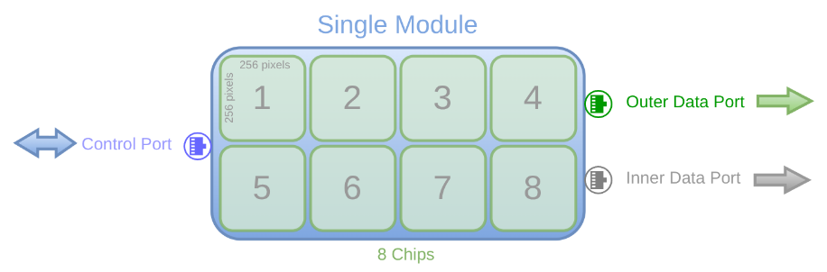
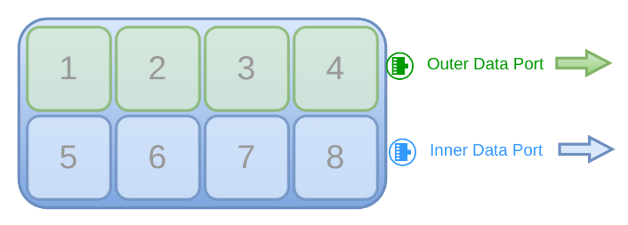
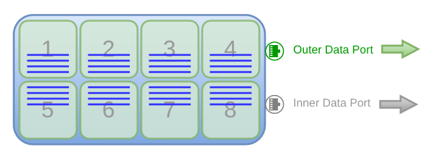
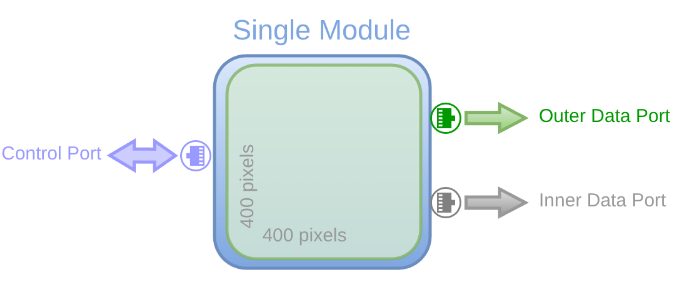
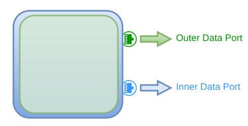
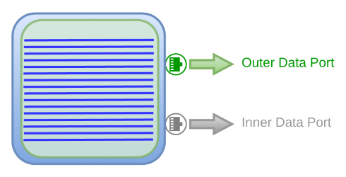
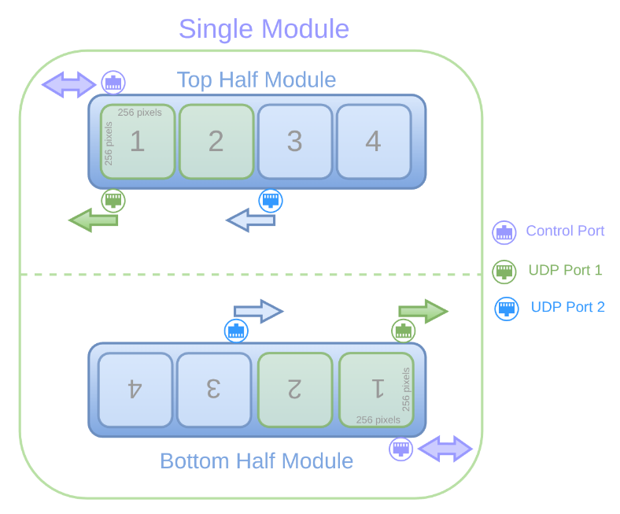
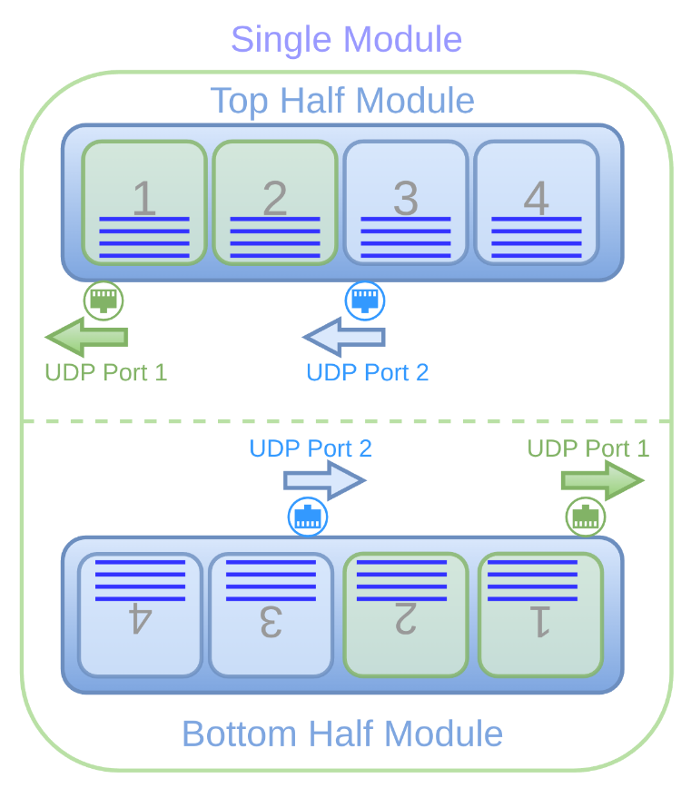

Data Format
================================

Each UDP port creates its own output file, which contains the image data transmitted over that port. 

Jungfrau
-------------

Single Port Configuration
^^^^^^^^^^^^^^^^^^^^^^^^^^

By default, only the outer 10GbE interface is enabled, transmitting the full image over a single UDP port. This results in one file per module containing the complete image.

Total image size = 524,288 bytes 
   - 8 chips (2 x 4 grid)
   - 256 x 256 pixels (chip size)
   - 2 bytes (pixel width)

Double Port Configuration
^^^^^^^^^^^^^^^^^^^^^^^^^^

If both interfaces are enabled using the ``numinterfaces`` command on compatible hardware and firmware, the image splits into top and bottom halves sent over two UDP ports:

   - The top half transmits via the inner interface (``udp_dstport2`` and ``udp_dstip2``).

   - The bottom half uses the outer interface(``udp_dstport`` and ``udp_dstip``).

The number of files per module equals the active UDP ports—two files per module when both interfaces are used.

Image size per UDP port or File = 262,144 bytes
    - **Complete Image size / 2**

Read Partial Rows
^^^^^^^^^^^^^^^^^^

The number of image rows per port can be adjusted using the ``readnrows`` command. By default, 512 rows are read, but a smaller value centers the readout vertically (e.g., 8 rows reads 4 above and 4 below the center). Increasing the value symmetrically expands the region toward the top and bottom. Permissible values are multiples of 8.

Total image size = 32,768 bytes 
   - 8 chips (2 x 4 grid)
   - **8** x 256 pixels (chip size: **8 rows**)
   - 2 bytes (pixel width)

Note: Still in prototype stage, writes complete image (padded or not depending on ``framepadding`` parameter) to file. Only the summary written to console in the receiver handles the read n rows to calculate complete images received. Only reduces network load, not file size. Use ``rx_roi`` for file size.

Moench
-------------

Single Port Configuration
^^^^^^^^^^^^^^^^^^^^^^^^^^

By default, only the outer 10GbE interface is enabled, transmitting the full image over a single UDP port. This results in one file per module containing the complete image.

Total image size = 320,000 bytes 
   - 400 x 400 pixels (chip size)
   - 2 bytes (pixel width)

Double Port Configuration
^^^^^^^^^^^^^^^^^^^^^^^^^^

If both interfaces are enabled using the ``numinterfaces`` command on compatible hardware and firmware, the image splits into top and bottom halves sent over two UDP ports:

   - The top half transmits via the inner interface (``udp_dstport2`` and ``udp_dstip2``).

   - The bottom half uses the outer interface(``udp_dstport`` and ``udp_dstip``).

The number of files per module equals the active UDP ports—two files per module when both interfaces are used.

Image size per UDP port or File = 160,000 bytes
    - **Complete Image size / 2**

Read Partial Rows
^^^^^^^^^^^^^^^^^^

The number of image rows per port can be adjusted using the ``readnrows`` command. By default, 400 rows are read, but a smaller value centers the readout vertically (e.g., 16 rows reads 8 above and 8 below the center). Increasing the value symmetrically expands the region toward the top and bottom. Permissible values are multiples of 16.

Total image size = 12,800 bytes 
   - **16** x 400 pixels (chip size: **16 rows**)
   - 2 bytes (pixel width)

Note: Still in prototype stage, writes complete image (padded or not depending on ``framepadding`` parameter) to file. Only the summary written to console in the receiver handles the read n rows to calculate complete images received. Only reduces network load, not file size. Use ``rx_roi`` for file size.

Eiger
-------------

Default Configuration
^^^^^^^^^^^^^^^^^^^^^^^^^^

Each Eiger module has two independent identical readout systems (other than firmware), each with its own control port and ``hostname`` to be configured with. They are referred to as the 'top' and 'bottom' half modules. The bottom half module is flipped vertically.

Each half module has 2 parallel UDP ports for 2 chips each. The left UDP port is configured with ``udp_dstport``, while the right UDP port is configured with ``udp_dstport2``. This is vice versa for the bottom half module.

Image size per UDP port or File = 262,144 bytes 
   - 2 chips (1 x 2 grid)
   - 256 x 256 pixels (chip size)
   - 2 bytes (default pixel width)

Pixel width
^^^^^^^^^^^^^

The pixel width can be configured to 4, 8, 16 (default) or 32 bits using the command ``dr``. This affects image size per UDP port or file.

Flip rows
^^^^^^^^^^

One can use the command ``fliprows`` along with a ``true`` to flip the rows vertically for the bottom or top half module. It is sent out to the reciever, but does not flip rows in the output file itself, but rather streams out this info via the json header and thus instructs the GUI to display them correctly.

Reducing network load
^^^^^^^^^^^^^^^^^^^^^^

**Activate**: By default, the ``hostname`` command activates the half module, and therefore, all UDP ports are enabled. One can deactivate a whole half module (ie. 2 UDP ports) using command  ``activate`` with the ``false`` argument. This will disable both UDP ports of the half module and no data will be transmitted from it.

**Datastream**: The ``datastream`` command with arguments ``left`` or ``right``, along with ``false`` can be used to disable the data streaming from one or all of the two UDP ports in a half module. This allows for more flexible configurations, such as reading only two chips or one UDP port of a half module. 

Note: Only the activated ports will write data as it does not make sense to write an empty file.

**Read Partial Rows**: The number of image rows per port can be adjusted using the ``readnrows`` command. By default, 256 rows are read, but a smaller value centers the readout vertically (e.g., 8 rows reads 4 above and 4 below the center). Increasing the value symmetrically expands the region toward the top and bottom. Permissible values depend on dynamic range and 10GbE enable.

Total image size per UDP Port = 8,192 bytes 
   - 2 chips (1 x 2 grid)
   - **8** x 256 pixels (chip size: **8 rows**)
   - 2 bytes (default pixel width)

Note: Still in prototype stage, writes complete image (padded or not depending on ``framepadding`` parameter) to file. Only the summary written to console in the receiver handles the read n rows to calculate complete images received. Only reduces network load, not file size. Use ``rx_roi`` for file size.

Mythen3 
-------------

Gotthard2
-------------

