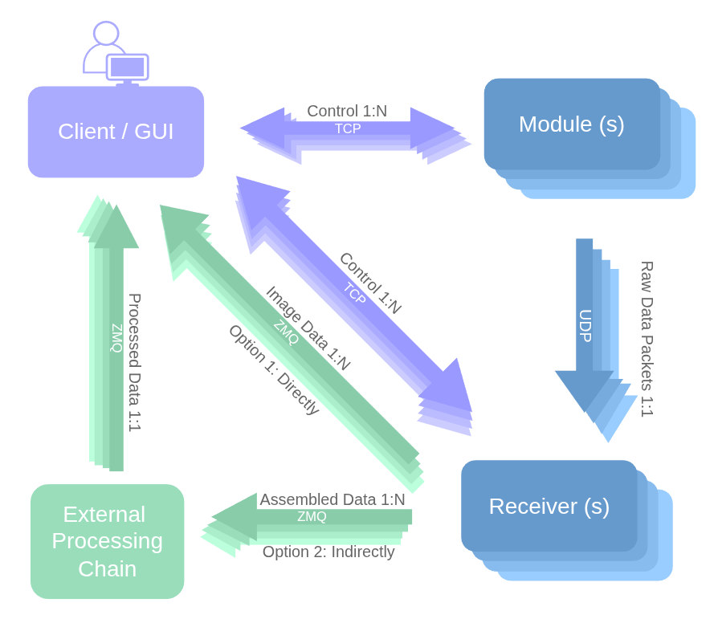
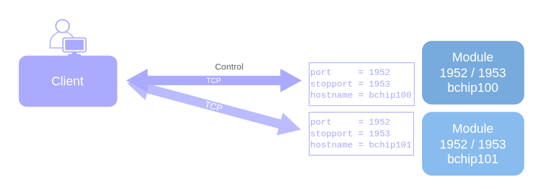

.. _software architecture:

Software Architecture
================================

Introdcution
------------------------------------

   Software Communication Architecture

| A detector can consist of a single module or multiple modules combined.

| Each module sends its data via UDP over distinct ports. Since UDP does not provide acknowledgements, data is transmitted as fast as possible, which can lead to packet loss if the network is not properly configured, among other causes.

| UDP data is received by one or more receivers—either built-in or custom. In the diagram above, there is one built-in receiver per module (1:1). For example, a detector with two modules (two hostnames) will have two built-in receivers.

| A single client can configure and control individual modules and receivers, or multiple of them in parallel. This communication is handled over TCP/IP, ensuring acknowledgements.

| A single image received by the receiver(s) may be split into multiple UDP packets. For each UDP port, the receiver reassembles these packets into sub-images, which can then be streamed:
* Directly to the GUI for display.
* To an external processing chain for post-processing and optional storage, which can in turn stream the processed data back to the GUI.

| Streaming image data from the receiver is done via ZMQ packets (core: TCP/IP).

| Next, we examine each component in detail.

Module
-------
* Single or multiple indepedent modules
* Configured from a single client via TCP, individually or in parallel. 
* Contains:
   * hardware such as sensor, chip, FPGA and microprocessor
   * an on-board CPU software (compiled in C for the microprocessor)
      * communicates with 
   * a firmware for the FPGA, handling register access

Receiver
--------
* Optional
* Local or remote 
* Module to Receiver: 1:1

Bal bal bla

